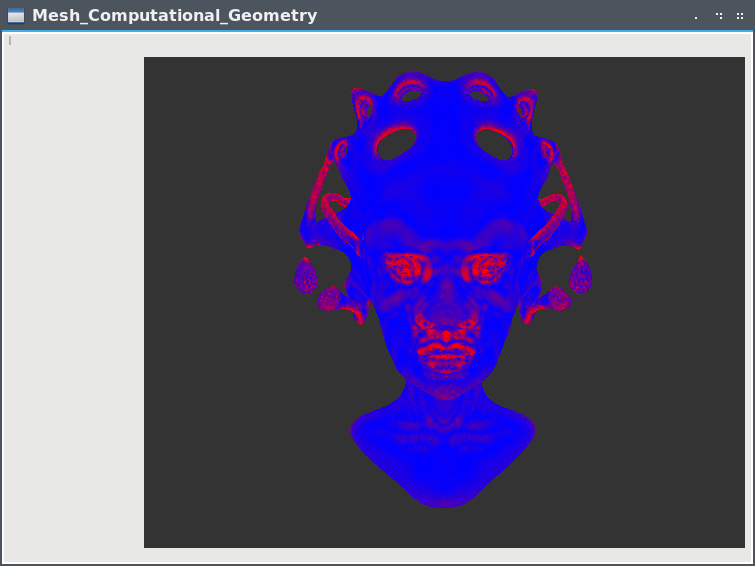
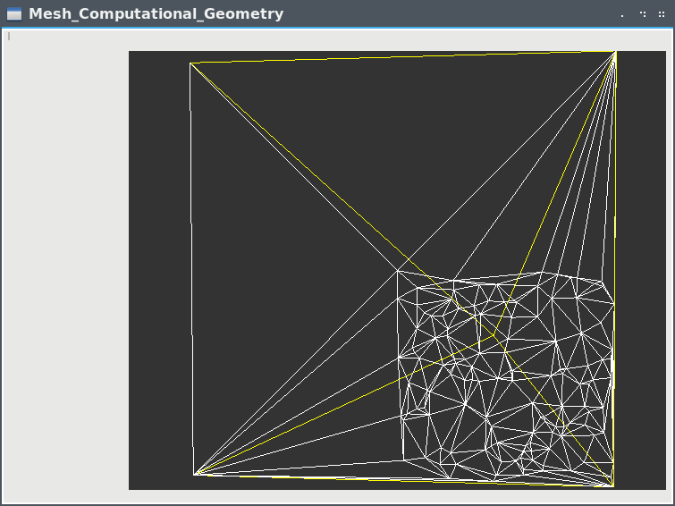
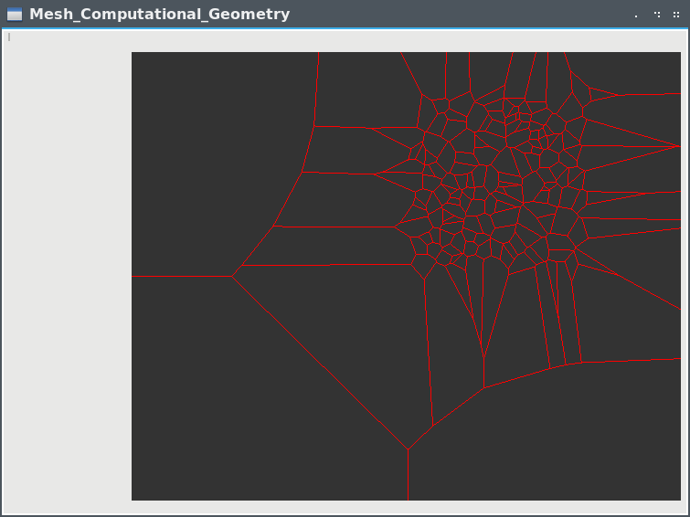
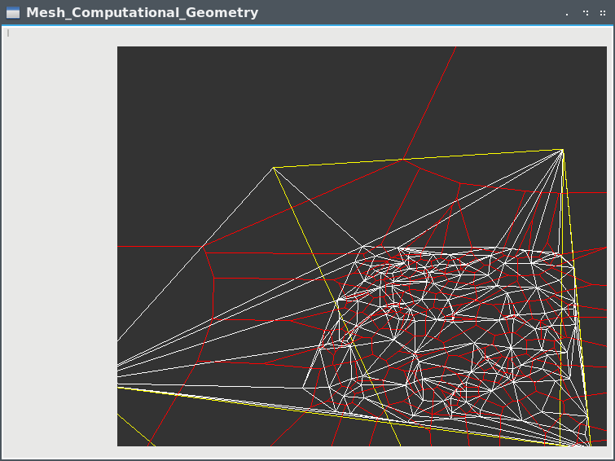
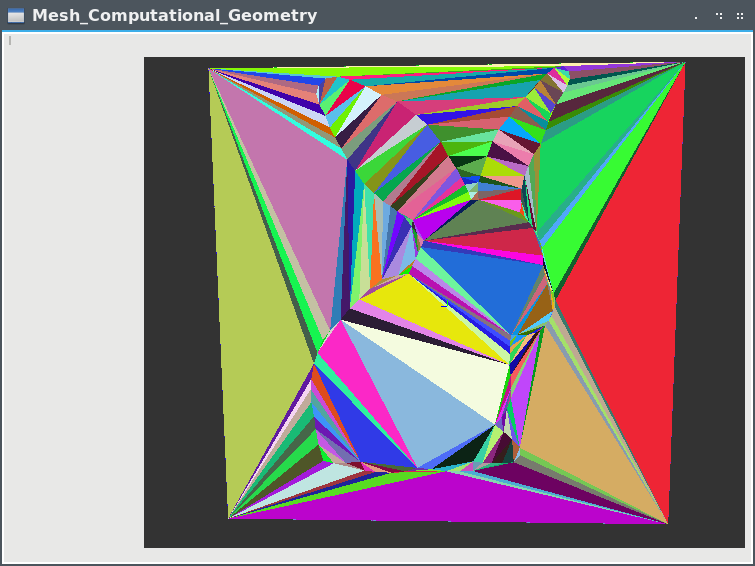
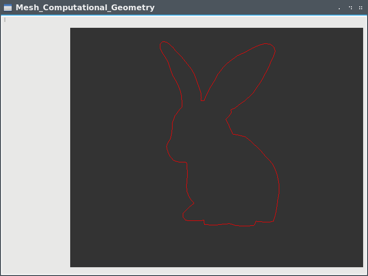

# TP Maillage et Algorithmie Geometrique Matheo Dumont

## Organisation du repertoire
* Les fichiers headers sont contenu dans `./include`
* Les fichiers sources sont dans `./src`
* `./build` contient le makefile et l'executable.
* `./data` contient les `.off` entres autres.

## Lancer le projet
     
### I. Avec l'executable :
Pour lancer le programme depuis la racine:  
```
cd build && ./GAM
```
   
### II. Le compiler avec cmake :
Si vous souhaitez le compiler vous meme sans utiliser Qtcreator, vous devrez avoir `cmake` installe.

La procedure, depuis la racine :

Creer le repertoire de build:
```
mkdir build && cd build
```

Generer le makefile a l'aide de cmake :
```
cmake ..
```

Et enfin compiler le projet et le lancer ...
```
make -j4 && ./GAM
```
   
### III. Le compiler et lancer avec Qtcreator :
   
Il y a toujours a la racine du projet le fichier `Mesh_Computational_Geometry.pro` configure comme demande dans le TP1,
il devrait etre en etat d'utilisation.
  
---

# TP 2
Concernant l'organisation des fichiers:  

- `laplacien .h/.cpp` contient le code relatif a son calcul
- `mesh_triangulation.cpp` pour la **Triangulation de Delaunay**
- `mesh_reconstruction.cpp` pour l'implementation de l'algorithme **Crust**
- `mesh_refinement.cpp` pour l'implemtation de l'algorithme **Rupper**
- `mesh.cpp` contient entre autre les fonctions d'affichage des differents algorithmes


Les `.h` pour les fichiers `mesh_*` sont en faite un seul `.h` qui est `mesh.h`. 

Tout le necessaire pour tester les algorithmes est disponible dans `mesh.cpp`.
Dans `mesh.cpp`, a la ligne 112 se trouve le constructeur, il contient les methodes commentees a appeler pour
tester chaque algorithme:
```cpp
Mesh::Mesh() : laplaciens(), sommets(), triangles()
{
    /******************** POUR TESTER ********************/
    // laplacien
    load_from_file("data/queen.off");
    compute_laplaciens();
    _type_display = 4;

    // voronoi et delaunay
    // this->make_inf_point();
    // boite_englobante(1);
    // _type_display = 2;

    // crust
    // this->make_inf_point();
    // boite_englobante(1000);
    // crust();
    // _type_display = 3;

    // ruppert
    // this->make_inf_point();
    // boite_englobante(1000);
    // ruppert();
    // _type_display = 2;

    /*****************************************************/
    ...
```
En faisant *clic droit*, vous pouvez a tout moment ajouter un point dans la triangulation, la methode `incremental_delaunay(Point)` sera appeler, elle se trouve dans `mesh_triangulation.cpp ligne 541`.


## I. Iterator et Circulator : FAIT
L'implementation se trouve dans `mesh.h`, dans la classe `Mesh`.
   
## II. Laplacien : FAIT 
Pour calculer la cotengante, je me suis aide de [ce site](http://rodolphe-vaillant.fr/?e=33).

Et le resultat sur `queen.off`:  


J'affiche l'intensite (donc non signe) de la courbure en un point avec un coef pour avoir un resultat plus visible.
Cela fait sens, les couleurs sont plus fortes sur les courbes et moins fortes sur les zones de plat.

---

# TP 3

## Triangulation de Delaunay : Fonctionne Avec Boite Englobante
La triangulation fonctionne dans une boite englobante, mais j'ai encore des problemes en dehors.
  


    
## Voronoi : FAIT
Le **Diagramme de Voronoi** est fonctionnel avec la **Triangulation de Delaunay**.
    



## Dualite Delaunay / Voronoi
  
Une image pour visualiser leurs dualite :  


---

# TP 4

Au choix : *Crust* ou *Simplification de maillage*, j'ai choisi **Crust**.

Avec le lapin :  

  
On obtient en suivant l'algo **Crust** :  


---

# TP 5

L'algorithme de Raffinement de Maillage **Ruppert**.


