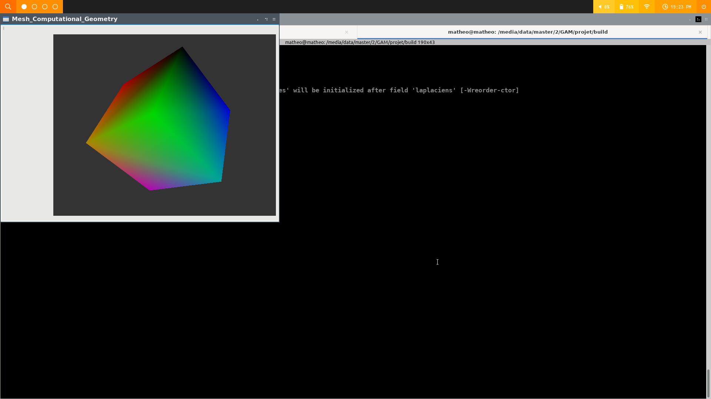

(3 versions : html, md ou pdf, le pdf a eu un peu de mal)
# TP Maillage et Algorithmie Geometrique Matheo Dumont
Je suis l'etudiant qui a eu des problemes avec QTcreator, du coup pour compiler, j'utilise cmake.
Si vous ne voulez pas recompiler pour changer des choses, le fichier binaire se trouve dans le repertoire `build`.

## Organisation du repertoire
* Les fichiers headers sont contenu dans `./include`
* Les fichiers sources sont dans `./src`
* `./build` contient le makefile et l'executable
* `./data` contient les `.off` : queen et cube

## Lancer le projet
     
### I. Avec l'executable :
Pour lancer le programme depuis la racine:  
```
cd build && ./GAM
```
   
### II. Le compiler avec cmake :
Si vous souhaitez le compiler vous meme sans utiliser Qtcreator, vous devrez avoir `cmake` installe.

La procedure, depuis la racine :

Creer le repertoire de build:
```
mkdir build && cd build
```

Generer le makefile a l'aide de cmake :
```
cmake ..
```

Et enfin compiler le projet et le lancer ...
```
make && ./GAM
```
   
### III. Le compiler et lancer avec Qtcreator :
   
Il y a toujours a la racine du projet le fichier `Mesh_Computational_Geometry.pro` configure comme demande dans le TP1,
il devrait etre en etat d'utilisation.
  
  
  
  
## TP 2
Concernant l'organisation des fichiers:  

- Le type `Point` possede son propore fichier en dehors de `mesh.hpp` ou j'ai ajouter plusieurs fonctions utiles (dot, cross, etc)
- `topography` contient les definitions de `Triangle` et `Sommet`, ainsi que quelques operations dessus  
- `algorithm` contient les algorithms, pour l'instant seulement le calcul du laplacien d'un sommet et autre ...  


### I. Iterator : FAIT
Les iterators sur les `Sommets` et `Triangles` d'un `Mesh` sont definit dans la classe mesh, fichier `mesh.hpp`, en prenant partie des iterators deja definit sur les vectors :

```cpp
typedef std::vector<Sommet>::iterator Iterator_on_vertices;
typedef std::vector<Triangle>::iterator Iterator_on_faces;...
``` 
... Et donc les fonctions begin et end concernant chaque cas, respectivement *vertices* et *faces* retournent les `begin()` et `end()` des vectors de `Sommet` et `Triangle`.

### II. Circulator : FAIT
Les circulators sont definit dans la class mesh, fichier `mesh.hpp` tel que:

```cpp
class Mesh
{

...

public:

  ...

    class Circulator_on_faces
        : public std::iterator<std::forward_iterator_tag, Triangle, int, const Triangle *, Triangle>
    {
    
    ...

```
Il en va de meme pour `Circulator_on_vertices`.  
  
Et ils peuvent etre utilises ainsi :
```cpp
Sommet s = ...
Mesh m;
Mesh::Circulator_on_faces ite = m.incident_faces(s);
```

Pour les tester, vous pouvez utiliser ces lignes dans le `src/main,cpp` (a decommenter):
```cpp
Mesh titi;
Mesh::Iterator_on_vertices its = titi.vertices_begin();

for (its = titi.vertices_begin(); its != titi.vertices_end(); ++its)
{
    Mesh::Circulator_on_faces cfbegin = titi.incident_faces(*its);
    int cmpt = 0;
    Mesh::Circulator_on_faces cf = cfbegin;

    do
    {
        cmpt++;
        ++cf;
    } while (cf != cfbegin);

    std ::cout << "valence of the vertex " << cfbegin._get_idx_sommet() << " is " << cmpt << std ::endl;
}
```
   
### III. Laplacien : FAIT mais pas d'affichage

La fonction qui calcul le laplacien d'un sommet est situee dans `src/algorithm.cpp` :

```cpp
Point Algorithm::laplacien(Mesh &m, Sommet &s)
{
    int idx_sommet = m.triangles[s.t].s[m.triangles[s.t].which_vertex(m.sommets, s)];

    Point &i = s.p;

    float aire = 0;
    Point u_laplacien;

    Mesh::Circulator_on_faces circ_faces = m.incident_faces(s);
    Mesh::Circulator_on_faces circ_faces_begin = circ_faces;

    std::vector<Triangle> faces;

    do
    {
        aire += Algorithm::aire_triangle(m.sommets, *circ_faces);
        faces.push_back(*circ_faces);
        ++circ_faces;

    } while (circ_faces != circ_faces_begin);
    aire = aire * 1 / 3;

    for (int v = 1; v < faces.size(); ++v)
    {
        Triangle &t = faces[v - 1];
        
        // on retrouve l'indice du sommet relativement au triangle
        int i_in_face = t.which_vertex(idx_sommet);

        // les Points comme dans l'illustration fournit avec le tp
        // les points k et kk sont ceux correspondant respectivement aux points dans angles alpha et beta
        Point &k = m.sommets[t.s[(i_in_face + 1) % 3]].p;
        Point &j = m.sommets[t.s[(i_in_face + 2) % 3]].p;

        t = faces[v];
        i_in_face = t.which_vertex(idx_sommet);
        Point &kk = m.sommets[t.s[(i_in_face + 2) % 3]].p;

        // vecteurs direction
        Point ji = j - i;
        float length_ji = norm(ji);
        Point ki = i - k;
        Point kki = i - kk;

        // calcul des cotangante alpha et beta
        float cot_alpha = norm(ki) / length_ji;
        float cot_beta = norm(kki) / length_ji;

        u_laplacien = u_laplacien + (cot_alpha + cot_beta) * (j - i);
    }

    return (float)(1/(2 * aire)) * u_laplacien;
}
```

Et la fonction pour l'air : 

```cpp
float Algorithm::aire_triangle(const Point &a, const Point &b, const Point &c)
{
    //https://fr.wikipedia.org/wiki/Aire_d%27un_triangle
    Point ab = b - a;
    Point ac = c - a;
    return 0.5f * norm(cross(ab, ac));
}
```

Les fonctions pour calculer la normal du laplacien et la courbure en un point sont implementees mais pas sur (pas testees et verifiees).

L'executable fournit charge et affiche le `cube.off` en utilisant les laplaciens pour calculer les couleurs.
Cela fonctionne aussi avec `queen.off`, je n'ai pas encore utilise la courbe pour afficher les couleurs.

Le calcul des laplaciens pour `cube.off` en chaque sommet donne (en partant du premier sommet): 
```cpp
(1, 0, 1)
(1.06066, -1.06066, 1.41421)
(-0.75, -0.53033, 1.43566)
(-0.848528, 1.14853, 1.14853)
(1.41421, 1.06066, -1.06066)
(1, -1, 0)
(-1.69706, -0.424264, -1.14853)
(-0.75, 1.43566, -0.53033)
```



# TP 3
L'executable se trouve dans `/build`.

## Triangulation de Delaunay PRESQUE
Tous ce qui a rapport a la triangulation se trouve dans `mesh_triangulation.cpp`.
L'ajout d'un point dans l'enveloppe fonctionne apparement, sans test consequent neanmoins.
Concernant l'ajout en dehors de l'enveloppe convexe, une partie est bugue. Le `split` est fait mais je ne `flip` pas
les aretes. 

    
## Voronoi PAS FAIT

